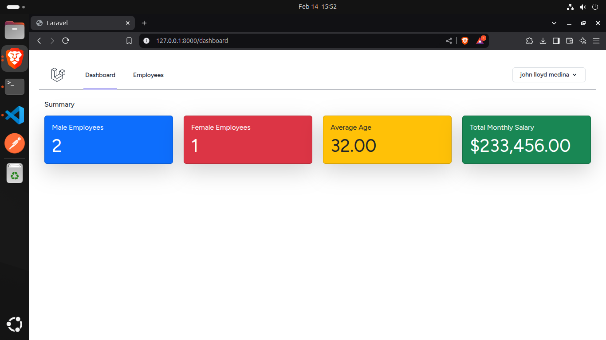
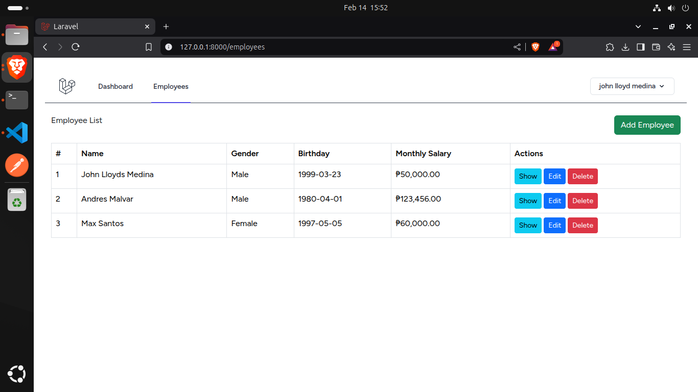
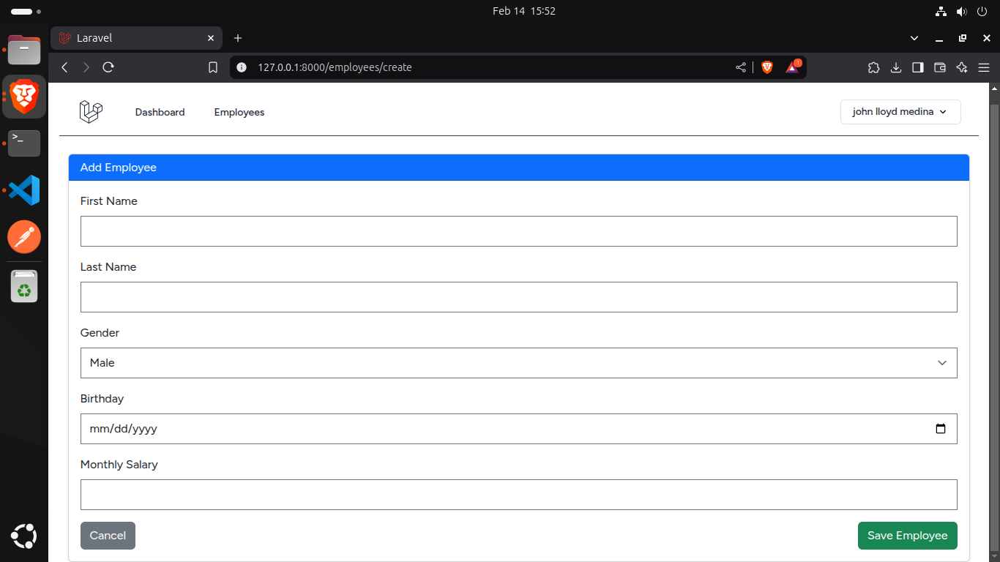
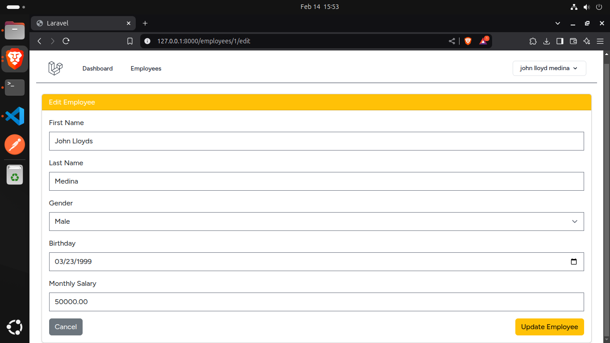

## **Installation**  
1️⃣ **Clone the repository**  
```bash
git clone git@github.com:johnlloydmedina/sugartech-exam.git
cd sugartech-exam
```  

2️⃣ **Install dependencies**  
```bash
composer install
npm install
```

3️⃣ **Set up environment file**  
```bash
cp .env.example .env
```
Configure your **database** in the `.env` file.  

4️⃣ **Run migrations & seed database**  
```bash
php artisan migrate --seed
```

5️⃣ **Generate key & start the development server**  
```bash
php artisan key:generate
composer run dev
```
Visit `http://127.0.0.1:8000` in your browser.  

## **Screenshots**  
### 🔹 **Dashboard Summary**  
  

### 🔹 **Employee List**  
  

### 🔹 **Add Employee Form**  
  

### 🔹 **Add Employee Form**  
  
